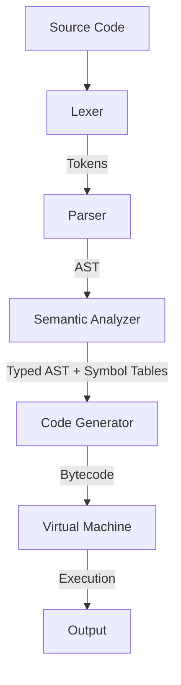

# Java-Safe C++ Architecture

## Overview
Java-Safe C++ is a fully self-contained compiler and virtual machine that executes a restricted subset of C++ safely.

The architecture consists of a classic compiler pipeline:

## Compiler Stages

1. **Lexer**: Converts source string into tokens.
2. **Parser**: A recursive-descent parser that builds the Abstract Syntax Tree (AST).
3. **Semantic Analyzer**: Performs type checking, symbol resolution, and scope management.
4. **Code Generator**: Lowers the AST into our custom bytecode format, injecting safety checks (like bounds and null checks) directly into the bytecode stream.

## Virtual Machine
The VM is a stack-based machine executing custom bytecode.
It maintains:
- **Operand Stack**: Used for temporary expression evaluation.
- **Call Stack**: Maintains function frames (Return IP, Local Variable Base).
- **Locals**: A flat array of local variables allocated based on frame base.
- **Heap**: A Managed Heap that tracks objects by reference count.
